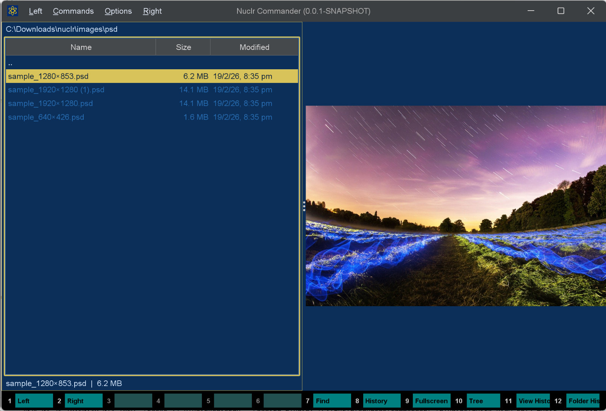
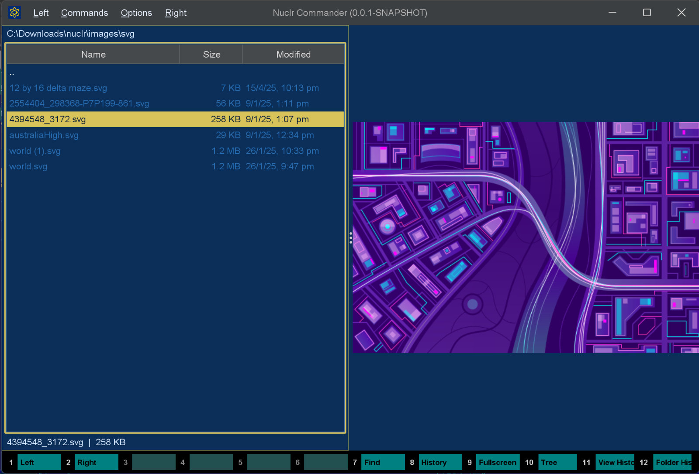
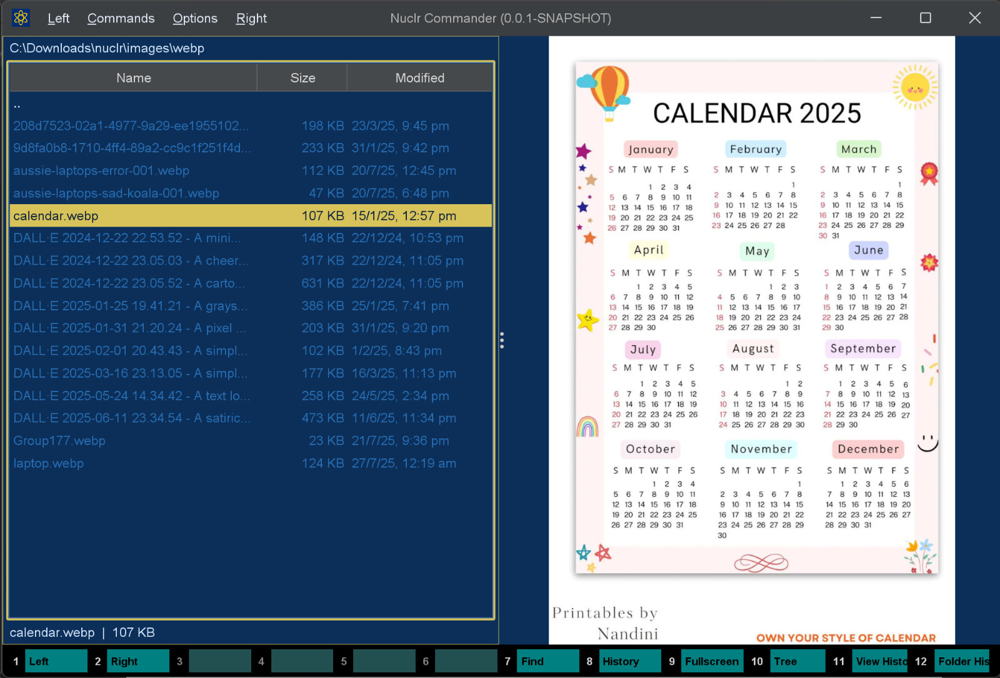

# 🖼️ ImageMagick Bridge

> A Nuclr Commander QuickView plugin that unlocks preview support for image formats handled by your local ImageMagick installation.



## ✨ What It Does

`imagemagick-bridge` adds QuickView support for image formats that are readable by a system-installed **ImageMagick 7** binary.

Instead of bundling codecs directly, the plugin:

- 🔎 Detects `magick` automatically from preferences, config, `PATH`, and common install locations
- 🧠 Queries `magick -list format` to discover which formats your installation can read
- ⚡ Converts the selected file to PNG on demand for QuickView rendering
- 🛡️ Applies configurable timeouts, input-size guards, and ImageMagick resource limits
- 🪟 Prompts the user to locate `magick` manually if auto-detection fails

## 📸 Screenshots

| QuickView | Preview Rendering |
| --- | --- |
|  |  |

## 🚀 Why This Plugin Exists

Nuclr Commander can already preview common formats. This plugin extends that experience to the long tail of formats supported by ImageMagick on your machine, including specialized, legacy, and graphics-tool-specific formats, without hardcoding an extension list into the plugin.

That means support depends on the capabilities of your local ImageMagick build.

## 🧩 How It Works

When the plugin starts, it:

1. Looks for an ImageMagick 7 executable.
2. Verifies the binary and reads the installed ImageMagick version.
3. Loads the set of readable formats from `magick -list format`.
4. Advertises those extensions to Nuclr Commander as QuickView-capable.
5. Converts the selected file to a temporary PNG when the preview panel opens.

For multi-frame or layered formats, the plugin requests only the first frame/layer using `[0]`, which keeps preview generation predictable and avoids multi-file output.

## ✅ Requirements

- ☕ Java 21
- 🧰 Maven
- 🖼️ ImageMagick 7 installed on the host system
- 🧭 Nuclr Commander with plugin support

## 📦 Installation

### For End Users

1. Install **ImageMagick 7** on your system.
2. Make sure the `magick` executable is available.
3. Copy the packaged plugin ZIP into your Nuclr Commander plugins directory.
4. Start Nuclr Commander.

If auto-detection fails, the plugin opens a file picker so the user can point it to `magick` or `magick.exe`.

### For Developers

Build the plugin with Maven:

```bash
mvn clean package
```

Packaged output is written under `target/`, including:

- `imagemagick-bridge-1.0.0.jar`
- `imagemagick-bridge-1.0.0.zip`

The repo also includes `deploy.bat`, which runs `mvn clean verify` and copies the ZIP and signature into a local Nuclr Commander plugin folder.

## ⚙️ Configuration

The plugin reads optional settings from `src/main/resources/imagemagick-bridge.properties`.

```properties
# Full path to the magick (IM7) executable.
executablePath=

# Timeout (seconds) for image conversion.
conversionTimeoutSeconds=30

# Timeout (seconds) for binary detection and format-list queries.
detectTimeoutSeconds=5

# Maximum input file size in bytes (512 MB). Set to 0 to disable.
maxInputSizeBytes=536870912

# Optional ImageMagick resource limits.
memoryLimit=
mapLimit=
diskLimit=
threadLimit=1

# Maximum PNG preview dimension.
maxPixelDimension=2048
```

### Setting Notes

- ⏱️ `conversionTimeoutSeconds`: Fails slow conversions before they hang the preview panel
- 📏 `maxInputSizeBytes`: Rejects very large files before conversion
- 🧮 `memoryLimit`, `mapLimit`, `diskLimit`: Passed through to ImageMagick as `-limit` flags
- 🧵 `threadLimit`: Keeps conversion resource usage predictable
- 🖼️ `maxPixelDimension`: Shrinks oversized images without upscaling smaller ones

## 🛠️ Development

### Run Tests

```bash
mvn test
```

### Package

```bash
mvn clean package -DskipTests
```

### Verify and Sign

```bash
mvn clean verify -Djarsigner.storepass=...
```

The `verify` phase in this repo also generates a detached signature for the plugin ZIP using a local PKCS#12 keystore path configured in the Maven build.

## 🧪 Behavior Details

- 📚 Supported extensions are discovered dynamically from the installed ImageMagick binary
- 🎯 Preview generation targets the first frame/layer only
- 🧼 Temporary input/output files are deleted after each conversion
- 🧵 Initialization and loading run on virtual threads
- 🎨 The preview panel follows Nuclr Commander theme updates
- ❌ If ImageMagick is unavailable, the plugin stays disabled instead of crashing the host

## ⚠️ Limitations

- The plugin requires **ImageMagick 7** specifically
- Preview success depends on delegates/codecs available in the installed ImageMagick build
- Some complex or extremely large formats may still fail due to resource limits or conversion timeouts
- Animated or multi-page formats are previewed as their first frame/page only

## 📁 Project Layout

```text
src/main/java        Plugin code
src/main/resources   Plugin metadata, packaged README, defaults
src/test/java        Unit tests
images/              README screenshots
```

## 📄 License

Licensed under the **Apache License 2.0**. See [LICENSE](LICENSE).
